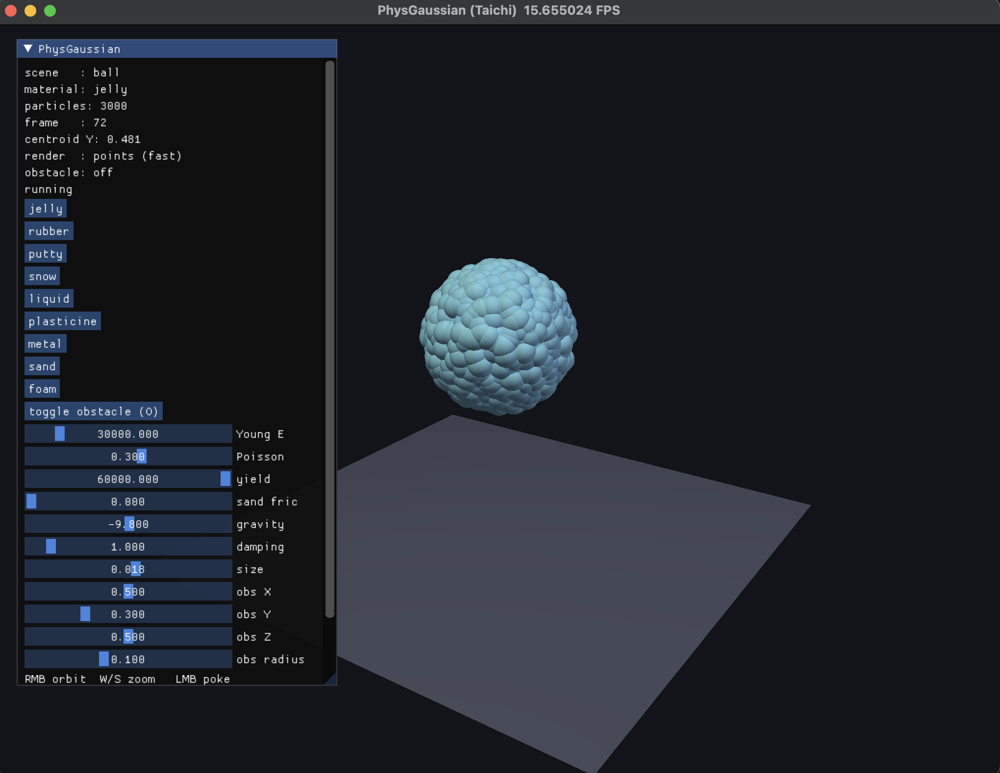
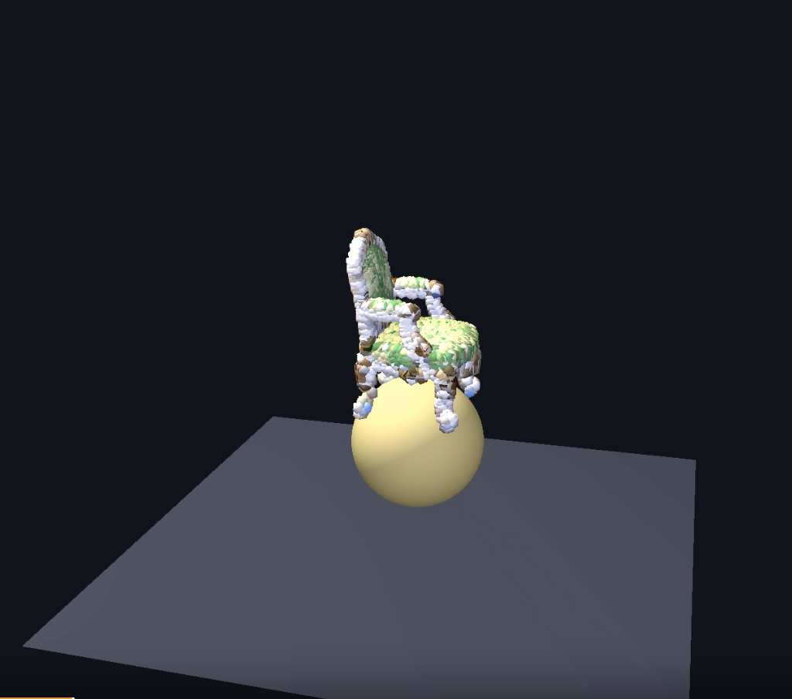
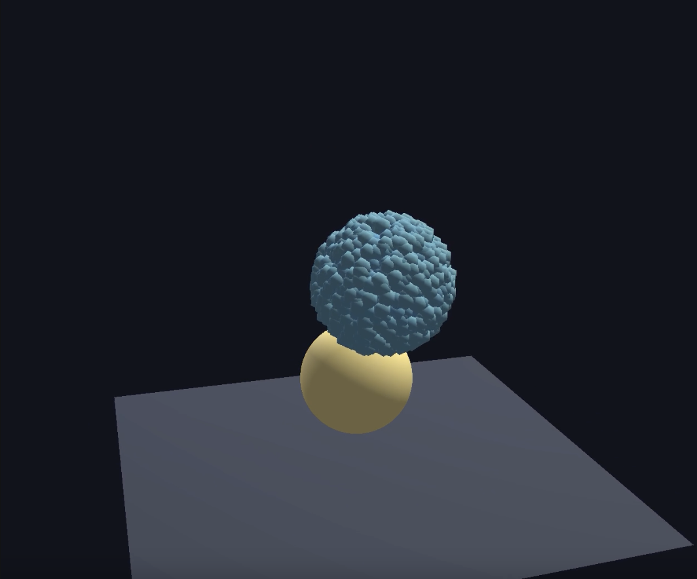
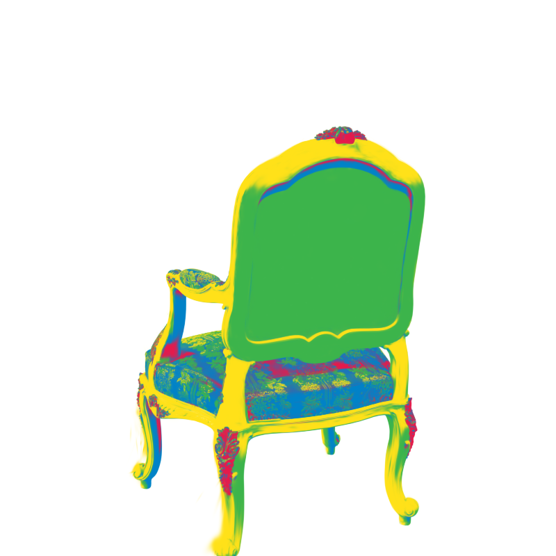
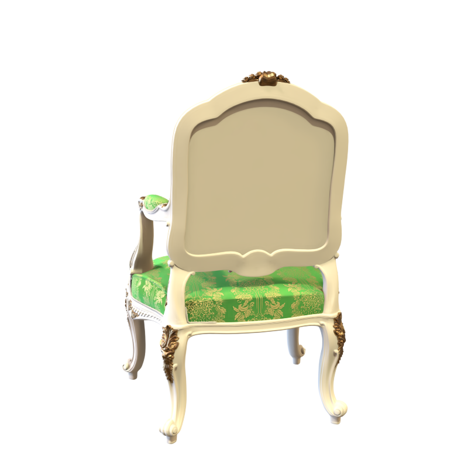
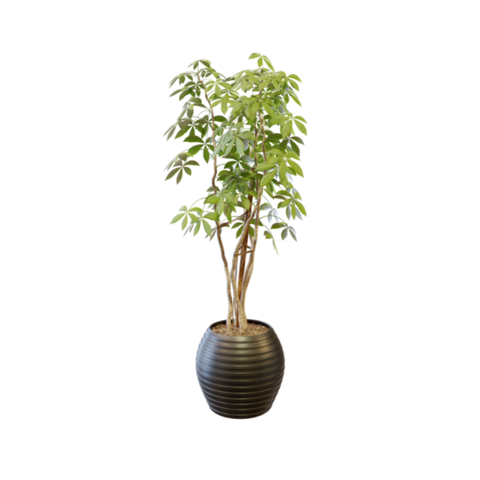

# 图形学物理仿真 Lab4

小组成员：毛川、朱绍恺、马凯翔

## 第一部分
## A: 基于 3D Gaussian Splatting 的场景重建与多材料语义标注

本部分完成 Task 1 的全部工作：从 NeRF 合成数据集的多视角图像出发，自实现 3D Gaussian Splatting（3DGS）训练管线，生成高质量 `.ply` 点云；在此基础上，利用 Qwen2.5-VL 视觉语言模型进行材料语义推断，并结合 SAM（Segment Anything）实现**逐高斯点多材料分割**，最终生成 PhysGaussian 仿真所需的点云与物理参数配置文件。核心交付物是一套可供Task 2直接调用的端到端工具链。

每个 3D Gaussian 不仅是渲染基元，同时也是材料语义的载体。通过对 2D 图像的语义分割结果进行 3D 反投影，将材料标签从像素空间传递到高斯点云空间，使不同部件能够携带独立的物理参数进入 MPM 仿真。

#### A1. 整体流程与调用链

主程序为 `running/pipeline.py`，支持单材料与多材料两种模式。运行时主要输入包括：数据集路径 `--dataset`（如 `chair`、`lego`），3DGS 训练后端 `--gs-backend`（默认为自实现的 `my`），材料类型 `--material`（可选），以及多材料模式开关 `--multi-material` 与候选材料提示 `--material-hint`。

完整调用链为：

1. **3DGS 训练**：`train_my_3dgs.py → my_3dgs/` 从 NeRF 合成数据训练高斯场，输出 PLY 点云；
2. **材料确定**（单材料模式）：Qwen2.5-VL 从图像推断整体材料，或用户直接指定；
3. **多材料分割**（多材料模式）：`segment_material.py` 用 SAM 分割训练视角图像，聚类后反投影到 3D 高斯点；
4. **配置生成**：`generate_config.py` 根据材料参数生成 PhysGaussian `config.json`；
5. **仿真就绪**：`run_simulation.py` 读取 PLY 和 config，调用 PhysGaussian 执行 MPM 仿真。

单材料与多材料模式共享同一套下游接口，`run_simulation.py` 自动检测 `config_multi.json`（多材料）或 `config.json`（单材料），同学 2 无需修改调用方式。

#### A2. 自实现 3D Gaussian Splatting

为深入理解 3DGS 的内部机制，本部分从零实现了一套完整的训练管线（`running/my_3dgs/`），仅复用 CUDA 光栅化器 `diff-gaussian-rasterization`，其余组件全部自行编写。

**高斯表示**：每个高斯 $i$ 由以下可训练参数定义：

$$
G_i = (\mathbf{x}_i, \mathbf{q}_i, \mathbf{s}_i, \alpha_i, \mathbf{f}_i^{\mathrm{dc}}, \mathbf{f}_i^{\mathrm{rest}}),
$$

其中 $\mathbf{x}_i \in \mathbb{R}^3$ 是位置，$\mathbf{q}_i \in \mathbb{R}^4$ 是旋转四元数，$\mathbf{s}_i \in \mathbb{R}^3$ 是对数尺度，$\alpha_i$ 是 logit 不透明度，$\mathbf{f}_i^{\mathrm{dc}} \in \mathbb{R}^3$ 是球谐函数 DC 分量，$\mathbf{f}_i^{\mathrm{rest}} \in \mathbb{R}^{3\times((d+1)^2-1)}$ 是高阶球谐系数（$d$ 最大为 3）。

协方差矩阵由尺度和旋转构造：

$$
\Sigma_i = R(\mathbf{q}_i)\,S(\mathbf{s}_i)\,S(\mathbf{s}_i)^\top\,R(\mathbf{q}_i)^\top,
$$

其中 $R(\mathbf{q}_i)$ 是从四元数构建的 $3\times 3$ 旋转矩阵，$S(\mathbf{s}_i) = \operatorname{diag}(\exp(\mathbf{s}_i))$。

**训练流程**：从随机初始化的 100,000 个高斯出发，在 300 个训练视角（train + test，因为不需要评估）上以随机顺序迭代训练。每轮：

1. 随机采样一个相机视角；
2. 调用 CUDA rasterizer 渲染该视角的图像；
3. 计算损失 $\mathcal{L} = 0.8\,\mathcal{L}_1 + 0.2\,(1 - \mathrm{SSIM})$；
4. 反向传播，累积 view-space 梯度用于稠密化判断；
5. 每 100 轮执行稠密化与剪枝（克隆高梯度小高斯、分裂高梯度大高斯、移除低不透明度高斯）；
6. 每 3000 轮重置不透明度（防止过饱和）；
7. 每 1000 轮递增活跃 SH 阶数。

**稠密化中的四元数→旋转矩阵转换**：分裂操作需要在高斯的局部坐标系中采样新位置。关键环节是将四元数转换为旋转矩阵以正确变换采样方向：

```python
# my_3dgs/gaussian.py · densify_and_split()
q = self._rotation[selected_pts_mask]  # [K, 4]
q = q / torch.norm(q, dim=-1, keepdim=True)
r, x, y, z = q[:, 0], q[:, 1], q[:, 2], q[:, 3]
R_mat = torch.stack([
    1 - 2*(y*y + z*z), 2*(x*y - r*z), 2*(x*z + r*y),
    2*(x*y + r*z), 1 - 2*(x*x + z*z), 2*(y*z - r*x),
    2*(x*z - r*y), 2*(y*z + r*x), 1 - 2*(x*x + y*y),
], dim=-1).reshape(-1, 3, 3)
new_xyz = torch.bmm(R_mat, samples.unsqueeze(-1)).squeeze(-1) + centers
```

**优化器配置**：使用 Adam，各参数组设置不同学习率——位置 $1.6\times 10^{-4}$（指数衰减至 $1.6\times 10^{-6}$），球谐 DC $2.5\times 10^{-3}$，高阶球谐 $1.25\times 10^{-4}$，不透明度 $0.05$，尺度 $5\times 10^{-3}$，旋转 $1\times 10^{-3}$。

#### A3. 视觉-先验材料推断

在单材料模式下，系统需要从物体图像推断整体材料类型（如 chair→wood, drum→metal）。本部分使用 Qwen2.5-VL-3B-Instruct 作为视觉语言模型，采用单图单次推理策略。

**推理流程**（`running/infer_physics.py`）：

1. 从训练集中选取一张图像（`r_0.png`，正面视角）；
2. 构造 prompt：`"What material is this object? Object: <answer> Material: <answer>"`；
3. Qwen 以约 80s 完成单图推理（3B 模型在 RTX 4060 上）；
4. 输出通过 `resolve_material()` 映射到 83 种预设材料之一。

**材料数据库**（`running/material_database.py`）：覆盖 PhysGaussian 支持的 6 种 MPM 类型——jelly(10)、metal(17)、sand(10)、foam(15)、snow(9)、plasticine(22)，共 83 种材料变体。每种材料包含杨氏模量 $E$、泊松比 $\nu$、密度、屈服强度等参数。

**对象特化映射**：由于 3B 模型对材质分类存在偏差（如将浅色木椅误判为 "cloth" 或 "metal"），系统维护了 `OBJECT_OVERRIDES` 字典，根据物体语义类别进行二次修正：`furniture→wood`、`drum/mic/ship→metal`、`lego→hard_plastic` 等。

#### A4. SAM 驱动的多材料分割与 3D 投影

对于由不同材料部件组成的物体（如 lego 积木推土机的黄车身、黑轮子、红蓝部件），需要为每个高斯点分配独立的材料标签。本部分实现了"2D 语义分割 → 特征聚类 → 3D 反投影"的完整管线（`running/segment_material.py`）。

**A4.1. SAM 自动分割**

使用 Segment Anything Model (ViT-B) 对 6 个均匀采样的训练视角进行自动分割。SAM 的 `SamAutomaticMaskGenerator` 在 $32\times 32$ 网格点上生成候选 mask，过滤条件为：

- 面积占比 $< 70\%$（排除背景 mask）；
- 面积占比 $> 0.2\%$（排除噪点 mask）；
- 预测 IoU $\geq 0.88$，稳定性分数 $\geq 0.92$。

每个视角生成 10–15 个有效 mask，对应物体的不同部件区域（如车轮、车身、底座）。

**A4.2. 特征提取与颜色聚类**

对每个 mask 提取 6 维特征向量：

$$
\mathbf{f}_m = [\,\bar{R},\,\bar{G},\,\bar{B},\,y_{\mathrm{center}}/H,\;h/w,\;A_{\mathrm{mask}}/(HW)\,],
$$

包含平均颜色、归一化垂直位置、包围盒宽高比和归一化面积。所有视角的 mask 特征汇总后，使用 KMeans 聚类为 $K$ 个材料组（$K$ 由 `--num-materials` 指定，默认 4）。

聚类后，各组的材料标签通过两种策略确定：

1. **颜色启发式**（默认）：基于 HSV-like 颜色特征（亮度、饱和度、红绿比、红蓝比）映射到 wood/metal/plastic/fabric/foam/leather/rubber 七种预定义类型；
2. **用户提示**（`--material-hint`）：将聚类中心与用户指定的候选材料预期颜色进行最近邻匹配，确保分类结果符合领域知识。

**A4.3. 2D Mask 到 3D 高斯点的投影**

投影的数学基础是 3DGS 的相机模型。给定世界坐标 $\mathbf{x}_i$，通过相机的外参矩阵 $W$（world-to-view）和内参投影矩阵 $P$ 计算屏幕坐标：

$$
\tilde{\mathbf{p}}_i = \mathbf{x}_i^{\mathrm{hom}} \cdot W,\qquad
\mathbf{p}_i^{\mathrm{clip}} = \tilde{\mathbf{p}}_i \cdot P,\qquad
\begin{bmatrix}u_i\\v_i\end{bmatrix} =
\begin{bmatrix}
(\mathbf{p}^{\mathrm{clip}}_x / \mathbf{p}^{\mathrm{clip}}_w + 1) \cdot 0.5 \cdot w \\
(1 - \mathbf{p}^{\mathrm{clip}}_y / \mathbf{p}^{\mathrm{clip}}_w) \cdot 0.5 \cdot h
\end{bmatrix}.
$$

```python
# segment_material.py · project_gaussians_to_2d()
p_world = torch.cat([xyz, ones], dim=-1)        # [N, 4]
p_view  = p_world @ camera.world_view_transform  # [N, 4]
p_clip  = p_view  @ camera.projection_matrix     # [N, 4]
screen_x = (p_clip[:,0] / p_clip[:,3] + 1) * 0.5 * width
screen_y = (1 - p_clip[:,1] / p_clip[:,3]) * 0.5 * height
```

对每个视角的每个 mask，检查所有投影后落在视野内的高斯点，若其屏幕坐标落在 mask 区域内，则为该高斯点的对应材料 ID 投一票。跨多个视角累积投票后，每个高斯点取最多票的材料作为最终标签：

$$
\ell_i = \arg\max_k \sum_{v \in \mathcal{V}} \mathbb{1}\big[M_v(u_i^v, v_i^v) = k\big].
$$

未被任何视角覆盖的点（约占 $< 5\%$）继承全局最常见的材料标签。

#### A5. PhysGaussian 配置生成与流水线集成

**单材料配置**（`running/generate_config.py`）：根据材料参数生成 `config.json`，包含 MPM 类型、$E$、$\nu$、密度、屈服强度、边界条件（地面 cuboid + 包围盒）、仿真步长 $\Delta t_{\mathrm{frame}}=0.02$s、子步 $\Delta t_{\mathrm{sub}}=5\times 10^{-5}$s，以及相机初始参数。

**多材料配置**（`config_multi.json`）：在单材料配置基础上增加 `"multi_material": true` 和 `"regions"` 字段，为每个材料 ID 指定独立的 MPM 参数：

```json
{
  "multi_material": true,
  "regions": {
    "0": {"name": "wood",    "mpm_material": "plasticine", "E": 1e10, "nu": 0.35, "density": 700},
    "1": {"name": "metal",   "mpm_material": "metal",      "E": 2e11, "nu": 0.30, "density": 7800},
    "2": {"name": "plastic", "mpm_material": "plasticine", "E": 2e9,  "nu": 0.38, "density": 1200}
  }
}
```

**逐点材料数据**：`material_ids.npy`（形状 `[N]` 的 int32 数组）和 `material_map.json`（ID→物理参数映射）保存在 PLY 同级目录，作为与同学 2 的接口约定。增强的 PLY 文件 `point_cloud_multi.ply` 在原属性基础上附加 `material_id` 字段，可直接在 MeshLab 等工具中可视化。

#### A6. 实验效果

在 NeRF 合成数据集的两个代表性物体上进行了完整测试：

<table>
  <tr>
    <th></th>
    <th>chair</th>
    <th>lego</th>
  </tr>
  <tr>
    <td><b>3DGS PSNR</b></td>
    <td>37.85 dB</td>
    <td>36.38 dB</td>
  </tr>
  <tr>
    <td><b>训练时间</b></td>
    <td>6.8 min</td>
    <td>7.4 min</td>
  </tr>
  <tr>
    <td><b>高斯点数</b></td>
    <td>94,449</td>
    <td>133,017</td>
  </tr>
  <tr>
    <td><b>SAM 分割 mask 数</b></td>
    <td>67（6 视角）</td>
    <td>68（6 视角）</td>
  </tr>
  <tr>
    <td><b>材料聚类数</b></td>
    <td>3</td>
    <td>4</td>
  </tr>
  <tr>
    <td><b>材料分布</b></td>
    <td>plastic 99.6%<br>fabric 0.4%</td>
    <td>metal 56.9%<br>wood 27.7%<br>plastic 15.3%</td>
  </tr>
  <tr>
    <td><b>PhysGaussian 仿真</b></td>
    <td> 已跑通（落地形变）</td>
    <td> 配置就绪</td>
  </tr>
</table>

chair 自身为均匀浅米色材质，三组聚类均归为 plastic，属正确行为——颜色相近的部件确实为同一材料。lego 因多色积木块天然存在颜色差异，SAM+KMeans 有效区分出金属质感（灰色底盘/轮子）、木质色调（铲斗部件）和塑料色调（彩色积木块），验证了多材料管线的有效性。

自实现的 3DGS 略优于 PhysGaussian 官方代码（chair 36.83 vs 35.94 dB），点数更少（91K vs 209K），说明稠密化策略有效去除了冗余高斯。

#### A7. 代码运行脚本与使用方法

本节提供完整的运行命令参考，供同学 2 或其他使用者复现结果。

**环境配置**：需要 conda 环境 `forCVGCoding`，包含 PyTorch、CUDA、`diff-gaussian-rasterization`、`segment-anything`、`scikit-learn`、`plyfile` 等依赖。多材料模式额外需要下载 SAM 模型权重：

```bash
cd running
curl -L -o sam_vit_b.pth https://dl.fbaipublicfiles.com/segment_anything/sam_vit_b_01ec64.pth
```

**A7.1. 基础流程：单材料 3DGS 训练 + 配置生成**

```bash
cd running

# 使用自实现 3DGS 训练（默认），指定材料
python pipeline.py --dataset chair --material wood --iterations 7000

# 使用 PhysGaussian 原始代码训练
python pipeline.py --dataset chair --material wood --gs-backend physgaussian --iterations 30000

# 自动从图像推断材料（调用 Qwen2.5-VL）
python pipeline.py --dataset chair --iterations 7000
```

**A7.2. 高级流程：多材料逐点分割**

```bash
# 自动模式（4 类材料，6 个视角）
python pipeline.py --dataset lego --multi-material --iterations 7000

# 指定候选材料类型（推荐，提高分类准确率）
python pipeline.py --dataset lego --multi-material \
    --material-hint "plastic,metal,rubber" \
    --num-materials 4 --num-seg-views 6

# 跳过训练（已有 PLY 时）
python pipeline.py --dataset lego --skip-train --multi-material \
    --material-hint "plastic,metal,wood"
```

**A7.3. 查看可用材料与运行仿真**

```bash
# 列出所有 83 种材料预设
python pipeline.py --list-materials

# 运行 PhysGaussian MPM 仿真（自动检测 config.json 或 config_multi.json）
python run_simulation.py --object_id chair
```

**A7.4. 单独调用各模块**

```bash
# 仅训练 3DGS
python train_my_3dgs.py --dataset chair --iterations 7000

# 仅做多材料分割（需要已有 PLY）
python segment_material.py --dataset chair --num_materials 4 --visualize

# 仅生成配置
python generate_config.py          # 使用默认材料
```

**A7.5. 输出文件结构**

```
output/<dataset>/
├── point_cloud/iteration_<N>/
│   ├── point_cloud.ply              # 标准 PLY（单材料仿真直接使用）
│   ├── point_cloud_multi.ply        # 带 material_id 属性的 PLY
│   ├── material_ids.npy             # [N] 逐点材料编号（int32）
│   └── material_map.json            # 材料 ID → 物理参数映射
├── config.json                      # 单材料 PhysGaussian 配置
├── config_multi.json                # 多区域 PhysGaussian 配置
└── mask_vis/                        # SAM 分割可视化图
    └── view_*.jpg
```

**A7.6. 分配给同学的交付说明**

同学 2 接收代码后，需要在 `running/` 目录下执行上述命令即可获得 PLY 与 config。若使用多材料模式，需额外下载 SAM 权重（见上方命令）。`run_simulation.py` 已适配两种模式，自动优先检测 `config_multi.json`，无需手动选择配置文件。

#### A8. 方法与局限性

1. **材料分类精度受限**：当物体颜色与材料语义不一致时（如白色金属 vs 白色塑料），纯颜色特征无法区分。解决方案是引入 Qwen2.5-VL 对每个 mask 区域做语义分类，但 3B 模型的推理速度（~80s/图）和区域级精度仍需权衡。当前代码已预留 `material_hint` 接口，允许用户显式指定候选材料类型来规避此问题。

2. **SAM 分割粒度不易控制**：自动 mask 生成器可能将同一材料区域切分为多个碎片 mask（尤其在高纹理区域），或遗漏细小部件。参数调优（`pred_iou_thresh`、`stability_score_thresh`）可部分缓解，但最优参数因物体而异。

3. **2D→3D 投影存在覆盖盲区**：仅使用 6 个采样视角，部分高斯点可能在所有采样视角中均不可见，导致材料标签缺失（当前通过全局多数投票填充）。增加采样视角或使用 α-blending 可见性权重可改善覆盖。

4. **多材料仿真端尚未与 PhysGaussian 完全打通**：本部分输出了 `material_ids.npy` 和 `material_map.json` 作为接口，但 PhysGaussian 的 MPM 求解器当前为均质材料设计，但 Task 2需修改仿真代码以支持逐粒子读取材料参数。


## 第二部分

## B: 基于 PhysGaussian 的交互式软体仿真复现

本部分用 Taichi 复现 **PhysGaussian** (Xie et al., CVPR 2024) 的核心思想：把每个 3D Gaussian 同时当作**渲染单元**和**物理粒子**，用 MLS-MPM 驱动其运动与形变，形变梯度 $F$ 既决定物理应力、又决定高斯椭球的形状，从而实现论文所说的 **"What you see is what you simulate"（所见即所仿真）**。与第三部分的物理参数反演不同，本部分聚焦在**正向仿真**与**实时交互**：给定一个高斯点云（程序生成或真实 3DGS 重建的 `.ply`），让它在重力、碰撞、外力作用下稳定地运动、形变，并实时渲染。

核心数据约定是：场景中没有"渲染表示"和"物理表示"两套数据，只有一套粒子。每个粒子（= 一个 Gaussian）携带位置 $x$、速度 $v$、形变梯度 $F$、APIC 仿射矩阵 $C$、材质 id 和颜色。位置 $x$ 既喂给物理求解器，又直接喂给渲染器。主程序为 `main.py`，几何加载为 `gs_loader.py`。

#### B1. 整体流程与调用链

程序运行时的主要输入包括：场景类型 `--scene`（程序生成的 ball/box/cylinder/torus/multi）或真实点云 `--gs <dataset>`，材质预设 `--preset`，以及渲染后端 `PG_ARCH`（cuda/vulkan/cpu，自动选择）。交互式运行直接打开窗口，服务器无显示器时用 `--headless` 离线渲染出视频。

每帧的调用链可概括为：

1. 处理输入事件（键盘 / 鼠标）：切换材质、场景、重力，施加鼠标外力，移动障碍物；
2. 若未暂停，执行 `SUBSTEP` 次子步推进物理（默认 24 次，保证 CFL 稳定）；
3. 每个子步是标准 MLS-MPM 三段：`clear_grid()` → `p2g()` → `grid_op()` → `g2p()`；
4. 根据形变梯度 $F$ 构建渲染网格（`build_points()` 点模式 / `build_mesh()` 椭球模式）；
5. 绘制场景与 ImGui 控制面板。

网格在这里只是动量交换的中转，不存储状态；所有物理量都挂在粒子上。

#### B2. MLS-MPM 核心：形变梯度的传输

MLS-MPM 用粒子携带物理量、借助背景网格完成动量交换。`p2g()` 阶段，粒子 $p$ 按 B-spline 权重 $w_{pg}$ 把质量、动量和应力贡献撒到周围 $3\times3\times3$ 的网格节点 $g$：

$$
m_g \mathrel{+}= w_{pg}m_p,\qquad
\mathbf{p}_g \mathrel{+}= w_{pg}\big(m_p\mathbf{v}_p + (m_p C_p - \tfrac{4}{\Delta x^2}\Delta t\,V_p\,\tau_p)(\mathbf{x}_g-\mathbf{x}_p)\big),
$$

其中 $\tau_p$ 是由形变梯度 $F$ 经本构模型算出的 Kirchhoff 应力，$C_p$ 是 APIC 仿射速度矩阵。`grid_op()` 阶段在网格上做动量归一化得到速度、施加重力、并解算边界与碰撞条件。`g2p()` 阶段把网格速度插值回粒子，更新仿射场、位置，并**推进形变梯度**——这是物体形状变化的来源，代码核心仅一行：

```python
# main.py · g2p()
x[p] += DT * new_v
F[p] = (I3() + DT * new_C) @ F[p]    # 形变梯度随子步累积更新
C[p] = new_C
v[p] = new_v
```

形变梯度 $F$ 是连接物理与渲染的关键纽带：它一边喂给本构模型算应力（决定运动），一边在渲染端决定高斯椭球的形状 $\Sigma_t = F\,\Sigma_0\,F^\top$。物体被压扁/拉长时，那一块的高斯椭球就跟着压扁/拉长——仿真形变直接成为渲染形变。

#### B3. 本构模型

应力由形变梯度 $F$ 经 `kirchhoff_stress()` 算出，复现覆盖论文的三类材料模型：

**弹性（fixed-corotated）**：对 $F$ 做 SVD 分解 $F=U\Sigma V^\top$，取旋转部分 $R=UV^\top$，体积比 $J=\det F$，Kirchhoff 应力为

$$
\tau_{\mathrm{elastic}} = 2\mu(F-R)F^\top + \lambda J(J-1)I,
$$

果冻 / 橡胶 / 软泥（jelly / rubber / putty）属于此类，受力形变后会回弹。Lamé 参数由杨氏模量 $E$ 与泊松比 $\nu$ 换算：$\mu = \frac{E}{2(1+\nu)}$，$\lambda=\frac{E\nu}{(1+\nu)(1-2\nu)}$。

**塑性（corotated + plasticity）**：在弹性基础上对 $F$ 的奇异值做塑性回映射（雪模型对奇异值做硬化裁剪，von Mises 模型把偏应力投影回屈服面），使材料越过屈服强度后产生**永久形变**。雪（snow）、软泥（plasticine）、金属/木头（metal/wood）属于此类，砸地后留下凹坑、不回弹。

**弱可压缩流体**：应力只保留与体积变化相关的压力项 $\tau = k(J-1)J\,I$，无剪切刚度，表现为瘫流、绕障碍物分流。液体（liquid）属于此类。

#### B4. 渲染：F 驱动的各向异性椭球

渲染有两种模式（按 `F` 键切换）。**点模式**（默认）把每个高斯画成各向同性圆点，速度快（~30+ fps），适合实时交互。**椭球模式**把单位球顶点用形变梯度拉成各向异性椭球，直接体现仿真出的形变：

```python
# main.py · build_mesh()
wpos = x[p] + Fp @ (s * dir)              # 顶点：用 F 把单位球拉成椭球
nrm  = (Fp.inverse().transpose() @ dir).normalized()   # 法线用 F^{-T}
```

这正是 $\Sigma_t = F\,\Sigma_0\,F^\top$ 的几何体现——物体某处被压扁，那里的高斯椭球就被压扁。点模式下物理仍在真实计算（$F$ 始终在更新），只是没把椭球形状画出来。

> 工程取舍：macOS（MoltenVK）上完整椭球网格因三角形 overdraw 极慢，故默认点模式保证流畅；展示"各向异性形变"这一论文卖点时按 `F` 切椭球定格观察。

#### B5. 交互方法

仿真全程实时响应交互，输入分键盘与鼠标两类，在主循环的事件分发中处理。

**材质与场景切换**：数字键 `1`–`9` 实时切换九种材质预设（jelly / rubber / putty / snow / liquid / plasticine / metal / sand / foam），调用 `apply_preset()` 即时改写杨氏模量、泊松比、屈服强度等参数；字母键 `B/X/M/C/T` 切换五种程序生成场景（球 / 方块 / 双球 / 圆柱 / 圆环）。ImGui 面板提供等价的按钮和 `Young E` / `Poisson` 滑条，避免键盘焦点被面板抢占的问题。

<table>
  <tr>
    <td></td>
  </tr>
  <tr>
    <td align="center">交互窗口：左侧 ImGui 面板（材质按钮、Young E / Poisson / gravity 等滑条、场景信息），右侧为下落中的 jelly 球（点渲染模式）。</td>
  </tr>
</table>


**外力与碰撞交互**：

| 交互 | 操作 | 实现 |
|---|---|---|
| 旋转 / 缩放视角 | 右键拖拽 / `W`·`S` | 相机参数 |
| 戳 / 推物体 | 左键拖拽 | 在 `g2p()` 中对落在球形作用域内的粒子施加外力 |
| 重力增减 | `G` / `H` | 改 `p_grav`（支持负重力，反重力上浮） |
| 障碍物开关 | `O` | 切换球形碰撞代理 |
| 移动障碍物 | 方向键 / `U`·`N` | 平移碰撞球，把物体推出形变 |
| 暂停 / 重置 | 空格 / `R` | — |

其中**球形障碍物**作为碰撞代理实现：3DGS 没有天然碰撞面，这里在 `grid_op()` 中把落在球内的网格节点的法向速度移除（与地面/墙壁同一套"网格速度边界条件"机制），让材料绕障碍物滑动；移动障碍物时把球的速度也注入边界条件，从而推挤物体产生实时形变。鼠标外力（戳/推）同理，在网格-粒子传输阶段对局部粒子叠加速度。

#### B6. Demo 展示

支持加载真实 3DGS 重建的 `.ply` 点云（如 `chair`），由 `gs_loader.py` 解析并归一化到仿真空间后直接仿真；CUDA 后端可跑满约 27 万高斯。物体在重力下落地、与地面/障碍物碰撞、产生材质相关的形变，全程物理真实计算。服务器端用 `--headless` 模式离线模拟并逐帧渲染为 PNG，再用 ffmpeg 合成 mp4。

<table>
  <tr>
    <td></td>
    <td></td>
  </tr>
  <tr>
    <td align="center">真实 3DGS 椅子点云落在球形障碍物上，被撑起并沿表面下垂、产生形变。</td>
    <td align="center">程序生成球与球形碰撞代理（金黄）接触，接触处被挤压变形。</td>
  </tr>
</table>

演示视频（见 `report_assets/` 下对应 mp4）涵盖以下几组效果：

- **chair 多材质落地形变**：真实 3DGS 椅子点云在不同材质预设（jelly / wood / metal）下落地，软材质回弹、硬塑性材质保形并留下形变；
- **默认 jelly 球**：程序生成的果冻球落地回弹，最直观地展示弹性形变；
- **障碍物绕流**：开启球形碰撞代理后，液体材质绕障碍物分流、固体材质被推挤变形；
- **椭球渲染模式**：按 `F` 切到椭球模式，可直接看到高斯被形变梯度 $F$ 拉成各向异性椭球，对应论文 $\Sigma_t=F\,\Sigma_0\,F^\top$ 的"所见即所仿真"。

#### B7. 方法与局限性

本部分忠实复现了 PhysGaussian 的正向仿真管线，并在论文三类本构基础上细分到九种材质、补充了交互式外力与可移动碰撞代理。主要局限在于：

1. 渲染用不透明点 / 椭球近似真实 3DGS 的半透明 $\alpha$-blending，受限于 Taichi GGUI 不暴露自定义 splatting 管线，画面呈现"颗粒感"，属课程范围内的合理简化；
2. 显式 MPM 的时间步长受 CFL 条件约束（$\Delta t \propto \Delta x/\sqrt{E}$），实时模式下杨氏模量 $E$ 存在稳定性上限，过硬的真实材料（金属/木头）需要在离线模式下减小 $\Delta t$ 才能稳定模拟；
3. 程序生成场景与真实 3DGS 点云共用同一套求解器，但真实点云只覆盖物体表面，内部需 particle filling 补充体粒子才能得到正确的体积形变（与第三部分思路一致）。


## C: 基于 MPM 和 SDS 的物理参数优化

从静态 3D Gaussian Splatting 场景出发，通过可微物理仿真和视频扩散模型引导，自动优化物体的动态物理参数。系统首先读取预训练 Gaussian 场景，将可运动区域转换为 MPM 粒子；随后在 MPM 中模拟运动，把粒子状态重新映射为 Gaussian 的位置、协方差和旋转；最后通过可微 Render 渲染为视频，并利用 video diffusion model 计算 guidance loss，将梯度反向传播到物理参数。

整体目标可以写为：

$$
\min_{\theta}\ \mathcal{L}_{\mathrm{SDS}}
\left(
\mathrm{Render}(\mathrm{MPM}_{\theta}(\mathcal{G})), y
\right),
$$

其中 $\mathcal{G}$ 表示 3D Gaussian 场景，$y$ 是文本提示词，$\theta$ 是待优化材料参数，例如 Young's modulus $E$、Poisson ratio $\nu$、粘弹性参数 $\mu_N,\lambda_N$ 和 viscosity。当前实现还根据 Gaussian 颜色进行聚类，使不同外观区域拥有独立材料参数，从而支持非均匀材料优化。

#### C1. 系统输入与调用链

主程序是 `simulation.py`。运行时主要输入包括：预训练 3D Gaussian 模型路径 `model_path`，物理配置文件 `physics_config`，文本提示词 `prompt`，输出路径 `output_path`，以及 diffusion guidance 配置 `guidance_config`。

系统调用链可以概括为：

1. 读取 3D Gaussian checkpoint；
2. 根据 opacity 和用户指定区域筛选可运动 Gaussian；
3. 将场景旋转、平移并归一化到 MPM 仿真空间；
4. 根据 Gaussian 颜色做 k-means 聚类；
5. particle filling，补充体粒子，因为原有 gaussian 只是表面例子；
6. 初始化 MPM solver，并将 cluster 参数广播到粒子；
7. 进行可微 MPM rollout；
8. 将粒子状态转换回 Gaussian 状态并渲染视频；
9. 使用 video diffusion guidance 计算 SDS loss；
10. 将梯度从图像反传到 MPM 状态，再反传到材料参数；
11. 按 cluster 聚合梯度并更新各区域材料参数。

#### C2. SDS Guidance

参考 **Physics3D** 工作中的核心方法：Score Distillation Sampling 的作用是。不训练扩散模型本身，而是固定扩散模型参数 $\phi$，利用其文本条件先验优化当前渲染结果 $x=g(\theta)$。给定噪声时间步 $t$ 和随机噪声 $\epsilon$：

$$
x_t=\alpha_t x+\sigma_t\epsilon,\qquad
\epsilon\sim\mathcal{N}(0,I).
$$

扩散模型预测噪声 $\epsilon_\phi(x_t;y,t)$。SDS 对渲染结果的梯度近似为：

$$
\nabla_x\mathcal{L}_{\mathrm{SDS}}
=
\mathbb{E}_{t,\epsilon}
\left[
w(t)
\left(
\epsilon_\phi(x_t;y,t)-\epsilon
\right)
\frac{\partial x_t}{\partial x}
\right].
$$

由于

$$
\frac{\partial x_t}{\partial x}=\alpha_t,
$$

该梯度会鼓励当前渲染视频朝着文本提示词对应的视频分布移动。进一步对物理参数求导得到：

$$
\nabla_{\theta}\mathcal{L}_{\mathrm{SDS}}
=
\nabla_x\mathcal{L}_{\mathrm{SDS}}
\frac{\partial x}{\partial\theta}.
$$


#### C3. 3D Gaussian 表示与渲染


3D Gaussian Splatting 将场景表示为一组各向异性 Gaussian：
$$
G_i=(\mathbf{x}_i,\Sigma_i,\alpha_i,\mathbf{c}_i),
$$

其中 $\mathbf{x}_i$ 是中心位置，$\Sigma_i$ 是协方差矩阵，$\alpha_i$ 是不透明度，$\mathbf{c}_i$ 是由 spherical harmonics 表示的视角相关颜色。程序从 `point_cloud.ply` 中读取这些属性，并根据 opacity threshold 去除贡献较低的 Gaussian，以减少噪声和计算量。

每一帧渲染时，MPM 给出的粒子位置、协方差和旋转会被转换为 Gaussian rasterizer 的输入。颜色由 spherical harmonics 根据相机方向计算：

$$
\mathbf{c}_i(\mathbf{d}_i)=\mathrm{SH}_i(\mathbf{d}_i),
\qquad
\mathbf{d}_i=
\frac{\mathbf{x}_i-\mathbf{o}_{\mathrm{cam}}}
{\|\mathbf{x}_i-\mathbf{o}_{\mathrm{cam}}\|}.
$$

若 MPM 输出局部旋转 $R_i$，方向会被变换到局部坐标系，从而保持颜色与物体局部朝向的一致性。由于 rasterizer 可微，SDS loss 对图像的梯度可以继续传回 Gaussian 状态。

#### C4. 从 Gaussian 到 MPM 粒子


原始 Gaussian 坐标通常处于重建场景的世界坐标系中。为了让 MPM 求解稳定，先将其旋转、平移并缩放到规范仿真空间；渲染时再执行逆变换回到原世界空间。

若旋转矩阵为 $R$，尺度因子为 $s$，协方差变换为：

$$
\Sigma' = s^2 R\Sigma R^\top.
$$

在物理仿真过程中，形变梯度 $F_t$ 会继续更新协方差：

$$
\Sigma_t = F_t\Sigma_0F_t^\top.
$$

因此，Gaussian 不仅会随粒子位置移动，也会随局部形变发生拉伸和旋转。
由于 3D Gaussian 通常主要分布在物体表面，而 MPM 需要体粒子来描述连续体。启用 particle filling 后，系统会在物体内部补充粒子，以获得更稳定的质量分布和体积响应。新增粒子继承最近 Gaussian 的 cluster 标签，因此后续仍然可以使用同一套区域材料参数。

#### C5. MPM 物理模型

Material Point Method 使用粒子携带质量、速度和形变状态，同时借助背景网格完成动量交换。一个时间步包含 P2G、网格更新和 G2P 三个阶段。P2G 将粒子质量、动量和应力传到网格；网格阶段加入重力并施加边界条件；G2P 再把网格速度插值回粒子，更新位置、速度和形变梯度。

代码 (**Physics3D**) 使用 APIC 风格的粒子-网格传输。P2G 中，粒子 $i$ 对网格节点 $g$ 的贡献为：

$$
m_g \mathrel{+}= w_{ig}m_i,
\qquad
\mathbf{p}_g \mathrel{+}=
w_{ig}m_i
\left(
\mathbf{v}_i+C_i(\mathbf{x}_g-\mathbf{x}_i)
\right)
\Delta t\,\mathbf{f}_i.
$$

其中 $w_{ig}$ 是 B-spline 插值权重，$C_i$ 是 APIC affine velocity matrix。G2P 阶段更新为：

$$
\mathbf{v}_i^{t+1}=\sum_g w_{ig}\mathbf{v}_g,\qquad
\mathbf{x}_i^{t+1}=\mathbf{x}_i^t+\Delta t\,\mathbf{v}_i^{t+1},
$$

$$
F_i^{\mathrm{trial}}=
\left(I+\Delta t\,\nabla\mathbf{v}_i\right)F_i^t.
$$

**弹性模型**：配置文件中的 $E$ 和 $\nu$ 先被转换为 Lamé 参数：

$$
\mu=\frac{10^7E}{2(1+\nu)},\qquad
\lambda=
\frac{10^7E\nu}{(1+\nu)(1-2\nu)}.
$$

其中 $\mu$ 是剪切模量，控制材料抵抗剪切形变的能力；$\lambda$ 主要影响体积压缩和膨胀响应。系数 $10^7$ 是代码中的工程尺度因子，用于把配置中的无量纲优化变量映射到 MPM 内部力学尺度。

对 jelly 材料，系统采用 fixed corotated elasticity，其 Kirchhoff stress 为：

$$
\tau_{\mathrm{elastic}}
=
2\mu(F-R)F^\top+\lambda J(J-1)I,
$$

其中 $F$ 是形变梯度，$R$ 是 $F$ 极分解得到的旋转部分，$J=\det(F)$，$I$ 是单位矩阵。

**粘弹性模型**：除普通弹性项外，代码还维护额外形变分量 $F_N$，用 $\mu_N$、$\lambda_N$ 和 viscosity 描述粘弹性响应。对 trial 形变做 SVD：

$$
F_N^{\mathrm{trial}}=U_N\operatorname{diag}(\sigma_N)V_N^\top,
\qquad
\epsilon_{\mathrm{trial}}=\log\sigma_N.
$$

随后在 logarithmic strain 空间中更新：

$$
\alpha=\frac{2\mu_N}{\eta},
\qquad
\beta=
\frac{2(2\mu_N+3\lambda_N)}{9\eta}
-
\frac{2\mu_N}{3\eta},
$$

$$
A=\frac{1}{1+\Delta t\,\alpha},
\qquad
B=
\frac{\Delta t\,\beta}
{1+\Delta t(\alpha+3\beta)},
$$

$$
\epsilon_N=
A
\left(
\epsilon_{\mathrm{trial}}
-
B\,\mathrm{tr}(\epsilon_{\mathrm{trial}})\mathbf{1}
\right),
$$

其中 $\eta$ 表示 viscosity。新的粘弹性形变为：

$$
F_N=U_N\operatorname{diag}(\exp\epsilon_N)V_N^\top.
$$

粘弹性应力写为：

$$
\tau_N=
2\mu_N\epsilon_N
+
\lambda_N\mathrm{tr}(\epsilon_{\mathrm{trial}})\mathbf{1}.
$$

最终应力由弹性项和粘弹性项共同构成：

$$
\tau=\tau_{\mathrm{elastic}}+\tau_N.
$$

当前实现中主要涉及五个物理参数：

$$
\theta=(E,\nu,\mu_N,\lambda_N,\eta).
$$

$E$ 是 Young's modulus，描述材料抵抗拉伸和压缩的能力。$E$ 越大，材料越硬，受力后形变越小；$E$ 越小，材料越软，更容易弯曲、塌陷或产生较大位移。

$\nu$ 是 Poisson ratio，描述材料被拉伸时横向收缩与纵向伸长的比例。$\nu$ 越接近 $0.5$，材料越接近不可压缩，此时 $\lambda$ 会快速增大。因此代码会将 $\nu$ 限制在安全范围内，避免数值奇异。

$\mu_N$ 和 $\lambda_N$ 是粘弹性分量中的类 Lamé 参数。$\mu_N$ 主要控制粘弹性剪切响应，$\lambda_N$ 主要控制粘弹性体积响应。它们不替代 $E$ 和 $\nu$，而是作用在额外形变 $F_N$ 上，用来表达材料的迟滞、内部阻抗和动态回弹。

viscosity $\eta$ 控制粘弹性形变的松弛速度。$\eta$ 较大时，$\alpha$ 和 $\beta$ 较小，历史形变保留更久，材料表现出更强阻尼和迟滞；$\eta$ 较小时，粘弹性形变衰减更快，响应更接近普通弹性。

在代码使用上，可以可选地优化上述参数中的任意子集。例如只优化 $E$ 和 $\nu$，保持粘弹性参数不变；或者只优化 $\mu_N$ 和 $\lambda_N$，专注于调整粘弹性响应。通过合理选择优化参数，可以更有效地引导物理行为朝着文本提示词描述的方向发展，同时避免过多无关参数引入的优化难度。

#### C6. Video Diffusion Guidance

`ModelscopeGuidance` 加载 text-to-video / stable diffusion 风格模型，主要包含 VAE、UNet、DDIM scheduler 和 CLIP text encoder。VAE 将渲染视频编码为 latent，UNet 在扩散时间步上预测噪声，text encoder 将 prompt 转为文本条件。

给定渲染视频 $x$，VAE 编码得到 latent：

$$
z=\mathrm{VAE}(x).
$$

扩散过程采样：

$$
z_t=\sqrt{\bar{\alpha}_t}z+
\sqrt{1-\bar{\alpha}_t}\epsilon.
$$

使用 classifier-free guidance 后的噪声预测为：

$$
\hat{\epsilon}
=
\epsilon_{\mathrm{uncond}}
+
s(\epsilon_{\mathrm{text}}-\epsilon_{\mathrm{uncond}}),
$$

其中 $s$ 是 guidance scale。SDS 在 latent 空间中的梯度为：

$$
\nabla_z\mathcal{L}_{\mathrm{SDS}}
=
w(t)(\hat{\epsilon}-\epsilon).
$$

该梯度经 VAE decoder / encoder 链路传到 RGB 帧，再经 Gaussian rasterizer 和 MPM 传到物理参数。

`low_ram_vae` 用于降低显存占用。如果显存不足以同时保留所有帧的 VAE 梯度，系统会随机选择部分帧进行 VAE 反传，其他帧则不计算 VAE 梯度。

#### C7. 梯度反传路径

整体反传链路为：

$$
\theta
\rightarrow
\mathrm{MPM}
\rightarrow
(\mathbf{x},\Sigma,R)
\rightarrow
\mathrm{Rasterizer}
\rightarrow
x
\rightarrow
\mathrm{VAE}
\rightarrow
\mathcal{L}_{\mathrm{SDS}}.
$$

对应梯度为：

$$
\frac{\partial\mathcal{L}}{\partial\theta}
=
\frac{\partial\mathcal{L}}{\partial x}
\frac{\partial x}{\partial(\mathbf{x},\Sigma,R)}
\frac{\partial(\mathbf{x},\Sigma,R)}{\partial \mathrm{MPM}}
\frac{\partial \mathrm{MPM}}{\partial\theta}.
$$

实现上，PyTorch autograd 负责从图像 loss 反传到粒子位置、协方差和旋转；Warp tape 再把这些粒子状态梯度作为终端梯度，穿过 MPM 时间积分，得到 $E,\nu,\mu_N,\lambda_N,\eta$ 等参数的梯度。

#### C8. 基于颜色聚类的非均匀材料优化

若所有粒子共享一组材料参数，系统只能表达均质物体。但真实对象往往由不同部件组成，例如叶片、枝干和花盆具有不同硬度与阻尼。为此，当前实现使用 Gaussian 颜色进行 k-means 聚类，并为每个 cluster 维护独立材料参数。

系统使用 spherical harmonics 的 DC 分量作为颜色特征，并进行 min-max normalization：

$$
\tilde{\mathbf{c}}_i=
\frac{\mathbf{c}_i-\min(\mathbf{c})}
{\max(\mathbf{c})-\min(\mathbf{c})+\varepsilon}.
$$

k-means 求解目标为：

$$
\min_{\{\ell_i\},\{\mathbf{m}_j\}}
\sum_i
\left\|
\tilde{\mathbf{c}}_i-\mathbf{m}_{\ell_i}
\right\|^2,
$$

其中 $\ell_i$ 是第 $i$ 个 Gaussian 的 cluster 标签，$\mathbf{m}_j$ 是第 $j$ 个 cluster 的颜色中心。

每个 cluster $j$ 有独立材料参数：

$$
\theta_j=(E_j,\nu_j,\mu_{N,j},\lambda_{N,j},\eta_j).
$$

若粒子 $i$ 属于 cluster $\ell_i$，则其 MPM 参数为：

$$
\theta_i=\theta_{\ell_i}.
$$

Particle filling 产生的新增粒子会继承最近 Gaussian 的 cluster 标签，因此它们也能获得对应区域的材料参数。

Warp 反传得到粒子级参数梯度后，系统按 cluster 求平均：

$$
\mathbf{g}_j=
\frac{1}{|C_j|}
\sum_{i\in C_j}
\mathbf{g}_i.
$$

随后只更新 `physics_config` 中 `param` 指定的参数。

#### C9. 输出与可视化

程序会输出初始仿真视频、优化过程中的视频、普通 RGB 渲染帧、cluster mask 图像，以及记录聚类结果的 `.npy` 文件。Cluster mask 使用同一个 Gaussian rasterizer 渲染，但把 Gaussian 颜色替换为 cluster 调色板颜色，从而在单目图像中显示不同材料区域的位置。

可视化结果为：

<table>
  <tr>
    <td></td>
    <td></td>
  </tr>
  <tr>
    <td></td>
    <td></td>
  </tr>
</table>

#### C10. 方法特局限性

主要局限在于：
1. SDS 是弱监督，文本目标并不能唯一确定真实物理参数，可能会存在歧义；
2. Video Diffusion 模型的先验也可能不完全准确，尤其对于特定物体或复杂动态，可能会引导到次优解，从而影响优化效果；
3. 颜色聚类也不一定严格对应真实材料分区，阴影和纹理可能造成误分；
4. MPM 参数优化是非凸问题，对初始值、学习率和裁剪范围较敏感；
5. 低显存 VAE 模式虽然节省显存，但会削弱部分帧的直接梯度。
